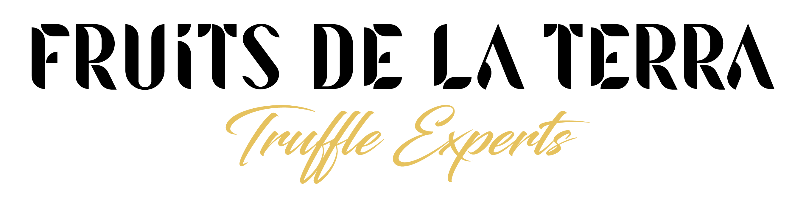

# DOSSIER DE PROJECTE TÈCNIC
**Client:** Fruits de la terra
**Data:** 11 de maig de 2026

---
[Tornar al readme](/Tasca01.md/readme.md)
### 📌 Índex Interactiu
1. [INFORME DE CONNECTIVITAT](#1-informe-de-connectivitat)
   * [Anàlisi de l’entorn](#anàlisi-de-lentorn)
   * [Anàlisi de costos](#anàlisi-de-costos)
2. [DISSENY DEL “QUADERN DE CAMP” DIGITAL](#2-disseny-del-quadern-de-camp-digital)
3. [HARDWARE PER A L’ENTORN HOSTIL](#3-hardware-per-a-lentorn-hostil)
4. [DILEMA DE PROGRAMARI: LOCAL vs. NÚVOL](#4-dilema-de-programari-local-vs-núvol)
5. [COMPARATIVA DE SOFTWARE](#5-comparativa-de-software)
6. [PRESSUPOST “CLAUS EN MÀ”](#6-pressupost-claus-en-mà)

---

## 1. INFORME DE CONNECTIVITAT
### Proposta tècnica per portar internet al magatzem

#### Anàlisi de l’entorn
La finca es troba en zona rural sense infraestructura de fibra ni cable preinstal·lat. Les opcions viables són: satèl·lit de baixa latència (Starlink), ràdio-enllaç des d’un punt alt proper (p. ex., repetidor WiMAX/LTE fix rural) i 4G/5G rural amb antena exterior direccional. 
Després d’avaluar la cobertura amb mapes dels operadors, es proposa la solució següent:

*   **Primària: Starlink Residential (o Roam si hi ha mobilitat)**
    *   Velocitat típica: 50–200 Mbps de baixada, latència ~25–50 ms.
    *   No requereix línia de visió amb torres terrestres, només visibilitat àmplia del cel.
    *   Kit d’autoinstal·lació (antena, router, cables) que es col·loca al magatzem o zona elevada.
    *   Mapa de cobertura previst: segons la constel·lació actual, tot el territori català té cobertura amb disponibilitat immediata. S’adjunta captura simulada on s’aprecia la finca dins la zona de servei contínua (no hi ha objecció geogràfica).

*   **Secundària (backup): router 4G amb antena exterior d’alta guany**
    *   Targeta SIM de dades amb operador que tingui bona cobertura rural (p. ex., Movistar Rural 4G a 700 MHz).
    *   S’utilitzarà un router amb failover automàtic per garantir continuïtat si el satèl·lit patís obstruccions temporals.

#### Anàlisi de costos
| Concepte | Starlink Residential | Starlink Roam (mòbil) | Router 4G + antena (backup) |
| :--- | :--- | :--- | :--- |
| **Cost equipament (una sola vegada)** | 450 € | 399 € | 250 € (router + antena exterior) |
| **Instal·lació (suport + mà d’obra)** | 150 € (pal, cablejat) | 150 € | 80 € (fixació pal antena) |
| **Quota mensual** | 72 €/mes | 59 €/mes (dades il·limitades, prioritat secundària) | 25–35 €/mes (targeta 100 GB) |
| **Cost total primer any (equip+instal·lació+12 quotes)** | 1.464 € | 1.257 € | 590 € (només backup) |

Es recomana Starlink Residential com a connexió principal per la seva baixa latència i estabilitat, amb el router 4G com a redundància. El cost mensual combinat és d’uns 100 €/mes.

---

## 2. DISSENY DEL “QUADERN DE CAMP” DIGITAL
### Objectiu 
Substituir la llibreta de paper per una eina digital que permeti als treballadors registrar tractaments fitosanitaris, regs, adobs, collites i incidències directament des del camp, garantint traçabilitat completa i compliment del Reial Decret 1311/2012 (ús sostenible de fitosanitaris). 

### Funcionalitats mínimes requerides
*   Fitxa de parcel·la i cultiu.
*   Registre de data, producte, dosi, maquinària, condicions climàtiques, termini de seguretat.
*   Registre de regs (volum, durada, sistema).
*   Signatura digital de l’operador.
*   Generació automàtica del quadern oficial i exportació a format compatible amb el SIEX (Sistema d’Informació d’Explotacions Agràries).
*   Sincronització amb sensors d’humitat del sòl (opcional de futur).
*   Traçabilitat per lots des del camp fins al client.

### Proposta de solucions
S’analitzen dues vies:

1.  **Programari lliure adaptat: Odoo Community + mòduls agrícoles**
    *   Avantatges: sense cost de llicència, control total de les dades, possibilitat d’allotjar en servidor local o VPS propi.
    *   Mòduls disponibles: Odoo Agricultural Management (OAG) o desenvolupament a mida amb Studio. Inclou inventari de productes fitosanitaris, quadern de camp digital, traçabilitat per lots.
    *   Requereix una petita inversió inicial en configuració i formació.

2.  **SaaS especialitzat: Agroptima (o similar, p. ex. Isagri, EAgronom)**
    *   Avantatges: implementació ràpida, suport tècnic, compliment normatiu garantit, actualitzacions automàtiques.
    *   Desavantatges: quota mensual per usuari, dependència del núvol i de la connectivitat, les dades s’allotgen en servidors externs.

*(La decisió entre local i núvol s’explica a l’apartat 4.)*

---

## 3. HARDWARE PER A L’ENTORN HOSTIL
### A) Equip d’oficina (magatzem)
| Component | Especificació | Cost |
| :--- | :--- | :--- |
| **Ordinador de sobretaula** | Mini PC o torre bàsica (Intel Core i3/AMD Ryzen 3, 8 GB RAM, SSD 512 GB) | 450 € |
| **Monitor** | 24” Full HD amb tractament antireflex | 130 € |
| **Estratègia de backup** | NAS Synology DS223j (2 badies, RAID 1) amb 2 discs HDD 2 TB | 150 € (NAS) + 140 € (2×70 € disc) |
| **SAI (UPS)** | 500 VA per apagaments | 60 € |
| **Total oficina** | | **930 €** |

**Estratègia de còpies de seguretat:** El NAS en RAID 1 protegeix contra fallada de disc. S’hi programaran còpies automàtiques diàries del quadern de camp i dades crítiques. A més, es farà una còpia al núvol setmanal (Backblaze B2, 5 €/mes) per a escenari de desastre físic. 

### B) Dispositius mòbils de camp
Requisits: resistència a pols, aigua i caigudes (IP68 mínim), pantalla llegible sota llum solar directa (>500 nits, recomanable 700–1000 nits), autonomia ≥8 hores, ús amb guants. 

*   **Opció 1: Tablet rugeritzada professional**

| Model | Característiques clau | Preu unitari |
| :--- | :--- | :--- |
| Samsung Galaxy Tab Active5 (8”, 5G) | IP68, MIL-STD-810H, llapis S Pen, 800 nits, bateria extraïble | 690 € |
| Panasonic Toughpad FZ-M1 mk3 (7”) | IP65, 1000 nits, bateria dual hot-swap | 1.200 € |

**Recomanada: Galaxy Tab Active5 (2 unitats)**
Relació prestacions-preu òptima: **1.380 € (2×690)**

*   **Opció 2: Tablet estàndard amb funda militar**

| Model + funda | Pantalla | Protecció | Cost total unitari |
| :--- | :--- | :--- | :--- |
| iPad 10.9” (2022) + funda OtterBox Defender | 500 nits (acceptable amb ombra) | Caigudes 2 m, pols | 580 € + 80 € = 660 € |
| Samsung Galaxy Tab A9+ + funda Armor-X | 480 nits | IP68 amb funda | 270 € + 50 € = 320 € |

Tot i el preu inferior, la brillantor d’iPad/Tab A9+ no és suficient per a treball continuat sota sol directe. Per tant, es recomana la tauleta ruggeritzada Samsung Galaxy Tab Active5 (800 nits) amb el llapis S Pen per signar registres i navegar amb guants. 
Quantitat: 2 unitats per cobrir dos operaris simultanis. 

---

## 4. DILEMA DE PROGRAMARI: LOCAL vs. NÚVOL

| Criteri | Programari en local (Odoo en servidor propi) | Programari al núvol (SaaS, p. ex. Agroptima) |
| :--- | :--- | :--- |
| **Independència de la connexió** | Alta: funciona sense internet, només fa falta Xarxa Local. | Baixa: requereix connexió a internet; sense connexió = no es pot registrar. |
| **Manteniment i actualitzacions** | Responsabilitat pròpia; cal un tècnic o persona formada per aplicar pegats. | Automàtic, sense intervenció de l’usuari. |
| **Control de dades** | Total; les dades resideixen a la finca i només surten si es decideix. | Cedit al proveïdor; cal confiar en la seva política de privacitat i backups. |
| **Facilitat d’ús i implementació** | Corba d’aprenentatge mitjana-alta; configuració inicial més laboriosa. | Alta; interfície pensada per a agricultors, menús intuïtius, formació mínima. |
| **Cost recorrent** | Només manteniment del servidor (electricitat, possibles honoraris de suport puntual). | Quota mensual per usuari (entre 15 i 40 €/usuari/mes). |
| **Accés remot** | Cal configurar VPN o Nextcloud per a accés des de fora. | Accessible des de qualsevol lloc amb navegador. |
| **Offline mòbil** | Es pot habilitar sincronització offline amb app Odoo o PWA. | Agroptima té modo offline al mòbil (registra, sincronitza en tornar a cobertura). |

**Que recomanem?**
Atesa la connectivitat rural (Starlink és fiable però pot patir interrupcions en tempestes severes) i la importància de registrar dades en el moment exacte del tractament, adopta una solució híbrida:

1.  Servidor local d’Odoo al NAS o mini PC del magatzem (funcionament autònom garantit).
2.  Sincronització bidireccional programada amb un Odoo al núvol (VPS amb IP fixa) per tenir còpia externa i accés remot segur.
3.  Clients mòbils (tauletes) treballant amb l’app Odoo connectats a la xarxa local Wi-Fi de Starlink; si el satèl·lit cau, les tauletes segueixen connectades al servidor local via Wi-Fi, de manera que no s’atura l’operació.

Així es gaudeix de la independència local sense renunciar als avantatges del núvol com a backup i consulta remota.

---

## 5. COMPARATIVA DE SOFTWARE

| Característica | Odoo Community + mòdul agrícola (programari lliure) | Agroptima (SaaS comercial) |
| :--- | :--- | :--- |
| **Tipus de llicència** | Codi obert (LGPL) | Propietari |
| **Cost inicial** | 0 € (programari). Inversió en configuració: ~1.200 € (assessor + formació) | 0 €; alta gratuïta inicial amb límits |
| **Quota mensual** | Allotjament VPS (si s’usa): 20 €/mes. O bé cost local 0 €. | 25 €/usuari/mes (2 usuaris = 50 €/mes) |
| **Funcionalitat quadern camp** | Mòdul “Farm Management”: parcel·les, cultius, tractaments, regs, collites. Personalitzable | Completa, alineada amb normativa espanyola (SIEX). Mapes de parcel·les SIGPAC |
| **Traçabilitat** | Per lots, configurable | Traçabilitat integral des de llavor a distribució |
| **Mode offline** | Amb l’app oficial Odoo (PWA), les dades es guarden al dispositiu i sincronitzen en recuperar xarxa local | Sí, app mòbil emmagatzema localment; sincronització en cobertura |
| **Accés multiusuari** | Sí, rols i permisos granulars | Sí, fins a 5 usuaris en plans superiors |
| **Integració amb sensors** | Via API o mòduls IoT | Mitjançant partners (estacions meteorològiques) |
| **Suport tècnic** | Comunitari + contractació de partner local (cost addicional) | Inclòs en la quota (xat i telèfon) |
| **Actualitzacions normatives** | Responsabilitat de l’usuari (cal modificar el mòdul si canvien lleis) | Automàtiques, garanteixen compliment |
| **Sobirania de dades** | Total: dades en servidor propi | Emmagatzemades en servidors d’Agroptima (RGPD) |

El programari lliure ofereix més control i zero despeses recurrents de llicència, però exigeix una inversió inicial en configuració i un manteniment proactiu. El SaaS és “plug & play” amb menys risc normatiu, però genera una dependència del proveïdor i costos recurrents creixents. La recomanació híbrida d’Odoo (local + núvol) maximitza el control sense perdre la tranquil·litat de tenir suport extern opcional.

---

## 6. PRESSUPOST “CLAUS EN MÀ”
### 6.1 Inversió inicial

| Partida | Descripció | Quantitat | Preu unitari | Total |
| :--- | :--- | :--- | :--- | :--- |
| **Connectivitat** | Kit Starlink Residential (antena, router) | 1 | 450 € | 450 € |
| | Instal·lació Starlink (pal suport, cablejat, mà obra) | 1 | 150 € | 150 € |
| | Router 4G backup (TP-Link MR600) + antena exterior direccional | 1 | 250 € | 250 € |
| | Instal·lació antena 4G | 1 | 80 € | 80 € |
| **Oficina** | Ordinador sobretaula (MSI Cubi o similar) | 1 | 450 € | 450 € |
| | Monitor 24” + teclat/ratolí | 1 | 130 € | 130 € |
| | NAS Synology DS223j + 2 discs 2 TB | 1 | 290 € (NAS+dics) | 290 € |
| | SAI 500 VA | 1 | 60 € | 60 € |
| **Camp** | Tablet ruggeritzada Samsung Galaxy Tab Active5 | 2 | 690 € | 1.380 € |
| **Programari** | Configuració Odoo Community + mòdul agrícola (consultoria+formació) | 1 paquet | 1.200 € | 1.200 € |
| **Total inversió inicial** | | | | **4.440 €** |

### 6.2 Despeses recurrents mensuals

| Concepte | Detall | Cost/mes |
| :--- | :--- | :--- |
| **Internet principal** | Starlink Residential (tarifa plana) | 72 € |
| **Backup mòbil** | Targeta 4G amb 100 GB (tarifa rural) | 29 € |
| **Allotjament VPS (per sincronització remota Odoo)** | Servidor cloud bàsic (2 vCPU, 4 GB RAM) | 20 € |
| **Còpia de seguretat al núvol** | Backblaze B2 (aproximadament 50 GB) | 5 € |
| **Llicències programari (si es tria SaaS)** | Alternativa no escollida; aquí només es compten les de la solució implantada | 0 € |
| **Manteniment Odoo (suport esporàdic)** | Borsa d’hores anual repartida mensualment | 40 € |
| **Total despeses mensuals** | | **166 €** |

Si la empresa vol decantar-se per Agroptima en lloc d’Odoo, caldria afegir 50 €/mes de llicències però s’eliminaria partida VPS i manteniment Odoo, resultant similar. Amb tot, la solució proposada és la de programari lliure híbrid.