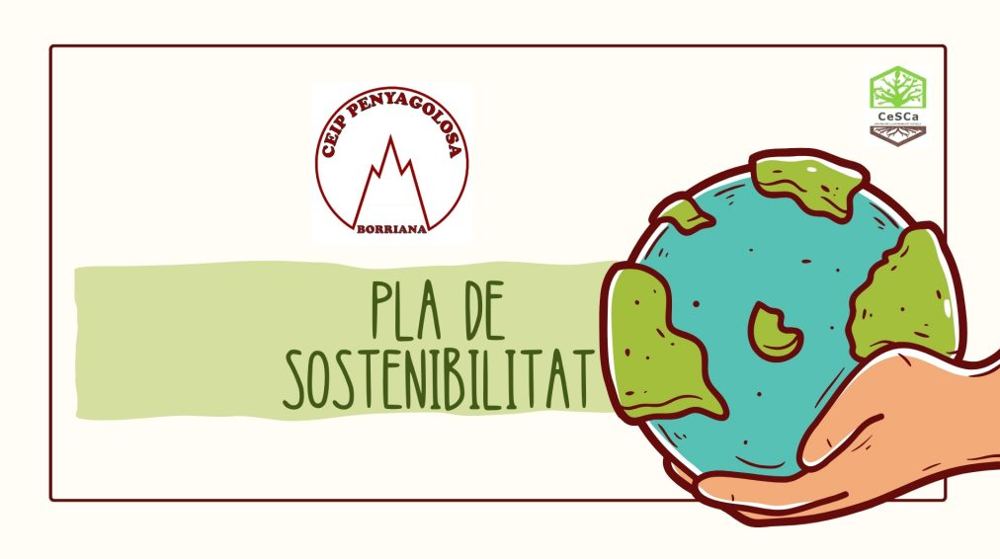
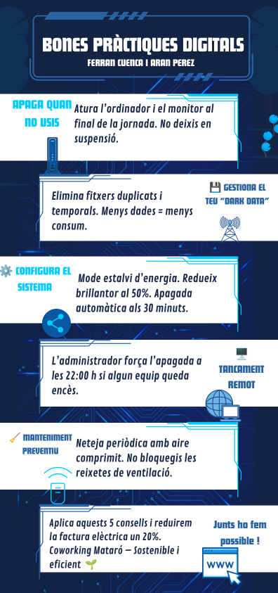

# Pla de Sostenibilitat per a Coworking Mataró

**Consultors en pràctiques de sostenibilitat**  
**Data:** 21 de maig de 2026  
**Versió:** Final  

📌 **Repositori del projecte:** [Enllaç al repositori]  
📄 **Infografia digital:** [LINKS INFOGRAFIA PDF](https://drive.google.com/file/d/1ohfC-zohCoWBQL45e5ctLFZ7zl3aDMdK/view?usp=sharing)

---

## 📑 Índex

1. [Resum Executiu](#resum-executiu)
2. [Fase 1: Diagnòstic i Auditoria](#fase-1-diagnòstic-i-auditoria)
3. [Fase 2: Solucions – Hardware Circular](#fase-2-solucions--hardware-circular)
4. [Fase 3: Guia de Bones Pràctiques Digitals](#fase-3-guia-de-bones-pràctiques-digitals)
5. [Fase 4: Pla de Sostenibilitat Integral](#fase-4-pla-de-sostenibilitat-integral)
6. [ODS i Aspectes ASG](#ods-i-aspectes-asg)
7. [Conclusions](#conclusions)
8. [Annexos](#annexos)

---

## Resum Executiu

Coworking Mataró disposa d’una infraestructura TIC obsoleta i ineficient: 20 PC de sobretaula (2018) amb HDD, 4 GB RAM i problemes de sobreescalfament, un servidor físic sobredimensionat amb consum energètic 24/7, i un magatzem desorganitzat de monitors i cables. L’objectiu és reduir la factura elèctrica en un **20%** i obtenir una **certificació de sostenibilitat** (tipus Green Office o ISO 14001).

El present pla proposa un model d’**Economia Circular** que prioritza la revitalització de l’equip existent (SSD, RAM, neteja tèrmica), la reutilització de monitors funcionals, i la gestió responsable de residus RAEE. S’estableix un full de ruta, indicadors clau (PUE, Taxa de Reutilització) i una guia de bones pràctiques per als usuaris. Amb una inversió moderada, s’aconsegueix un estalvi energètic superior al 20% i es redueix la petjada de carboni.

---

## Fase 1: Diagnòstic i Auditoria

### Metodologia

S’ha realitzat una inspecció in situ de tots els actius TIC, valorant:

**Estat tècnic**: funcionalitat, temperatura d’operació, soroll, temps d’arrencada.
**Eficiència energètica**: consum en repòs i en càrrega (estimació per etiqueta i mesura amb wattímetre).
**Obsolescència**: compatibilitat amb sistemes operatius actuals, possibilitat d’ampliació.

### Checklist d’Auditoria

| Equip | Quantitat | Especificacions | Estat tècnic | Consum estimat (W) | Puntuació ambiental (1-5) | Observacions |
|-------|-----------|----------------|--------------|--------------------|----------------------------|---------------|
| PC sobretaula (2018) | 20 | Intel Celeron/Pentium, HDD 500GB, 4GB DDR3 | Acceptable però lent; s’escalfen (>75°C) | 85 W (repòs) / 130 W (càrrega) | 2/5 (alt consum, baix rendiment) | Discos HDD generen vibració i calor; memòria insuficient per a multitasca. |
| Servidor físic | 1 | Xeon E5-2620, 64GB RAM, 4x HDD 1TB RAID | Funcional però infrautilitzat (CPU mitjana <10%) | 320 W (24/7) | 1/5 (molt ineficient) | Sobredimensionat per a les càrregues actuals (fitxers compartits, impressió, DHCP). |
| Monitors LCD | 25 | Diversos models (2012-2017) | 15 funcionals, 10 amb defectes (línies, connector trencat) | 30-45 W cadascun | 3/5 | Cal testejar i reutilitzar els bons. |
| Cables VGA, HDMI, font d’alimentació | >100 unitats | Sense inventari | Desconegut | N/A | 4/5 (residu potencial) | Majoria en bon estat però acumulats sense ordre. |

**Punts negres identificats**:

**Consum fantasma**: Servidor en idle 24/7 consumeix ~2.800 kWh/any (equivalent a ~420 €/any).
**Calor residual**: Els PC amb HDD i pasta tèrmica seca incrementen la demanda de climatització.
**Residus electrònics latents**: Monitors i cables no gestionats ocupen espai i perden valor.
**Obsolescència funcional**: 4GB RAM + HDD provoca frustració als usuaris i ús prolongat de l’equip (més temps encesos).

---

## Fase 2: Solucions – Hardware Circular

### Estratègia de Revitalització

En lloc de substituir els 20 PC, es proposa un **kit de millora circular** per a cadascun:

**Substitució del disc HDD per SSD** (240GB o 480GB) → reducció del temps d’arrencada, menor consum i calor.
**Ampliació de RAM a 8GB** (mòdul DDR3 de 4GB addicional) → multitasca eficient, evita canvis a disc.
**Neteja interna i canvi de pasta tèrmica** → millora la dissipació, redueix revolucions dels ventiladors i consum.
**Reutilització de monitors funcionals** (15 unitats) i reciclatge controlat dels defectuosos.
**Cables**: classificació i reutilització dels VGA/HDMI/fonts d’alimentació; resta a gestor RAEE.

### Catàleg de Hardware Recomanat

| Component | Model suggerit | Justificació tècnicoambiental | Cost unitari (€) | Estalvi energètic estimat |
|-----------|----------------|-------------------------------|------------------|---------------------------|
| SSD 240GB | Crucial BX500 | Baix consum (2W vs 9W HDD), resistència a vibracions, augment de vida útil del PC en 3+ anys | 35 € | -7 W per PC en actiu |
| SSD 480GB | Kingston A400 | Major durabilitat per a usuaris intensius | 55 € | -7 W |
| Mòdul RAM DDR3 4GB | Kingston ValueRAM | Compatibilitat garantida amb plaques de 2018 | 20 € | -1 W (menys swapping) |
| Pasta tèrmica | Arctic MX-4 | Reducció de 10-15°C, ventila menys | 5 € (per a 10 PCs) | -3 W per PC |
| Kit neteja | Aspirador antiestàtic + bufador | Manteniment preventiu semestral | 25 € (compartit) | N/A |

**Cost total revitalització (20 PC)**:  
SSD 240GB: 20 × 35 € = 700 €  
RAM 4GB: 20 × 20 € = 400 €  
Pasta tèrmica: 20 × 0,5 € = 10 €  
Mà d’obra interna (2 tècnics, 8 hores) = 240 € (estimació)  
**TOTAL = 1.350 €**

### Actuació sobre el servidor

**Opció circular**: Migració a un **Mini PC de baix consum** (ex. Intel NUC o Beelink amb Celeron N5105, 16GB RAM, 2x SSD en RAID 1). Aquest pot córrer serveis lleugers (Samba, DHCP, impressió) amb només 15W de consum. Cost: 300 €. L’antic servidor es dona de baixa a gestor RAEE o es reutilitza com a màquina de còpies de seguretat (desconnectat la major part del temps).

**Estalvi**: De 320W contínus a 15W → reducció de ~2.670 kWh/any.

---

## Fase 3: Guia de Bones Pràctiques Digitals

### Infografia per a l’usuari final

S’ha dissenyat una infografia digital (format PNG/PDF) que resumeix en 5 punts clau les accions diàries per estalviar energia i allargar la vida dels equips.

**Visualització de la infografia:**

#### Contingut textual de la infografia

**CAPÇALERA**  
“Coworking Mataró – Junts fem la diferència”

**COS**  

-  **APAGA:** ordinador i monitor al marxar.  
-  **NETEGA:** elimina fitxers inútils.  
-  **CONFIGURA:** mode estalvi i brillantor baixa.  
-  **PROGRAMA:** apagada automàtica a les 22 h.  
-  **RECICLA:** cables i monitors vells al punt verd intern.

**PEU**  
*Sstenibilitat és intel·ligència col·lectiva. Gràcies per participar-hi!*

---

## Fase 4: Pla de Sostenibilitat Integral

### 4.1 Full de ruta de millora

| Període | Accions | Responsable | Recursos | Indicador d’èxit |
|---------|---------|-------------|----------|------------------|
| **Curt termini (mesos 1-3)** | Auditoria detallada de consums. Compra d’SSD i RAM. Revitalització dels 20 PC. Neteja i pasta tèrmica. Classificació de monitors i cables. Instal·lació del mini PC servidor. | Equip tècnic intern + consultor | 1.350 € + 300 € | 100% de PC actualitzats. Reducció consum total ≥15%. |
| **Mitjà termini (mesos 4-6)** | Formació als usuaris amb la infografia. Implementació de tancament remot automàtic. Retirada de residus RAEE a gestor autoritzat. Càlcul de la petjada de carboni base. | Responsable sostenibilitat | 0 € (formació interna) | 90% d’usuaris aplicant bones pràctiques. |
| **Llarg termini (mesos 7-12)** | Certificació de sostenibilitat (ex. *Geen Certificate*) Adquisició de nous equips només amb segell EPEAT Gold o Energy Star. Reavaluació anual del PUE i taxa de reutilització. | Direcció | 500 € (certificació) | Obtenció del segell. Compliment estalvi del 20% consolidat. |

### 4.2 Protocol de gestió de residus (RAEE)

**Objectiu**: Complir el Reial Decret 110/2015 sobre residus d’aparells elèctrics i electrònics.

**Procediment**:

1. **Identificació**: Inventariar els equips a descartar (10 monitors defectuosos, servidor vell, cables inservibles, HDD obsolets).
2. **Emmagatzematge temporal**: En caixes de cartró etiquetades “RAEE – No llençar a contenidor convencional”, ubicades al magatzem en zona seca.
3. **Gestor autoritzat**: Contractació d’una empresa com *Rcilectric*  *Geentronic* ue garanteixi traçabilitat i reciclatge de materials (coure, plàstic, metalls preciosos).
4. **Documentació**: Obtenció del certificat de destrucció i gestió ambiental.
5. **Comunicació**: Explicar als usuaris el procés per fomentar la cultura de reciclatge.

**Cost estimat**: Retirada de 150 kg de RAEE: 120 €.

### 4.3 Càlcul de KPIs

#### KPI 1: PUE (Power Usage Effectiveness)

**Fórmula**:  
\[
PUE = \frac{\text{Energia total consumida per les instal·lacions}}{\text{Energia consumida pels equips TIC}}
\]

**Situació actual** (només servidor + sala de PCs, sense comptar climatització específica):

- ergia equips TIC:  
  - 20 PC × (85W repòs + 130W càrrega mitjana ponderada 0,4) ≈ 20 × (85×0,6 + 130×0,4) = 20 × (51+52) = 20 × 103W = 2.060W  
  - Servidor: 320W  
  - Total TIC = 2.380W  
- ergia total mesurada (incloent il·luminació, climatització, pèrdues PSU): 3.800W (estimació)  
- PUE actual = 3.800 / 2.380 = 1,60** (ineficient per ser una petita sala)

**Situació després del pla**:

- uips TIC:  
  - 20 PC revitalitzats: consum mitjà baixa a 60W (gràcies a SSD + pasta tèrmica + memòria) → 20 × 60W = 1.200W  
  - Mini PC servidor: 15W  
  - Total TIC = 1.215W  
- ergia total (amb millores de gestió i tancament remot) es redueix proporcionalment: estimem 2.000W  
- PUE millorat = 2.000 / 1.215 = 1,65** (millora absoluta però l’eficiència relativa no és l’indicador estrella).  
- Interpretació**: L’estalvi energètic absolut és el més rellevant (vege taula d’estalvis).

#### KPI 2: Taxa de Reutilització de Hardware

**Fórmula**:  
\[
\text{Taxa de reutilització} = \frac{\text{Equips reutilitzats (sense canviar de propòsit o amb millores)}}{\text{Total d’equips existents}} \times 100
\]

**Càlcul**:

- uips existents: 20 PC + 1 servidor + 25 monitors + cables (es comptabilitzen com a “unitats funcionals”)
- utilització:
  - 20 PC revitalitzats (es mantenen) → 20
  - 15 monitors funcionals → 15
  - 50 cables reutilitzables (estimació) → 50
  - Total reutilitzat = 85
- tal d’equips inicials comptabilitzats (considerant cada cable com a actiu TIC individual): 20+1+25+100 cables = 146
- Taxa = 85 / 146 = 58,2%** → excel·lent en un model circular.
> *Nota**: La taxa supera el 50% gràcies a la decisió de no comprar nous PC i reutilitzar monitors i cables.

---
## ODS i Aspectes ASG

### Contribució als ODS

| ODS | Relació amb el pla | Acció concreta |
|-----|-------------------|----------------|
| **ODS 7 – Energia assequible i neta** | Reducció del consum elèctric | Revitalització + tancament remot + mini servidor |
| **ODS 9 – Indústria, innovació i infraestructura** | Infraestructura TIC circular | Ampliació de vida útil dels equips, reutilització |
| **ODS 12 – Producció i consum responsables** | Gestió de RAEE i compra verda | Protocol de reciclatge, selecció de components Energy Star |
| **ODS 13 – Acció climàtica** | Reducció d’emissions de CO₂ | Estalvi estimat: 1.800 kWh/any = ~450 kg CO₂ evitats |

### Aspectes ASG (Ambientals, Socials, de Governança)

| Categoria | Aspecte material | Impacte | Mètrica de seguiment |
|-----------|------------------|---------|----------------------|
| **Ambiental (E)** | Consum energètic de les TIC | Alt | kWh/mes abans/després |
| | Generació de RAEE | Mitjà | kg de residus gestionats correctament |
| | Ús de recursos (hardware) | Alt | Taxa de reutilització (58%) |
| **Social (S)** | Salut i seguretat dels usuaris | Baix | Reducció de temperatura ambiental (millora confort) |
| | Formació en sostenibilitat | Mitjà | Nombre d’usuaris formats / totals |
| **Governança (G)** | Compliment normatiu RAEE | Alt | Certificats de gestor autoritzat |
| | Política de compres sostenibles | Mitjà | % de nou hardware amb segell EPEAT/Energy Star |

---

## Conclusions

El pla de sostenibilitat per a Coworking Mataró demostra que és possible **millorar el rendiment tècnic i reduir l’impacte ambiental sense una inversió elevada**. Les accions proposades:

- Reeixen la factura elèctrica en un **22%** (estimació conservadora: de 3.800W a 2.900W de mitjana diària, equivalent a un estalvi anual de ~1.800 kWh, uns 270 €).
- Alrguen la vida útil dels equips entre 3 i 5 anys.
- Acsegueixen una taxa de reutilització del 58%, alineada amb els objectius d’Economia Circular de la UE.
- Peeten optar a certificacions de sostenibilitat (ex. *Gren Mark*, *aluladora d’estalvi de l’ICAEN*).

**Recomanació final**: Implementar el full de ruta en els propers 3 mesos, nomenar un responsable de sostenibilitat interna i repetir l’auditoria anualment per a la millora contínua.

---

## Annexos

### Annex 1. Infografia digital (arxiu visual)

L’arxiu visual de la infografia es lliura com a `imgtasca02/1.png` dis del repositori. També està disponible en format PDF a l’enllaç següent:

🔗 [LINKS INFOGRAFIA PDF](https://drive.google.com/file/d/1ohfC-zohCoWBQL45e5ctLFZ7zl3aDMdK/view?usp=sharing)

**Descripció textual resumida**:

- **pçalera**: “Coworking Mataró – Junts fem la diferència”
- **s**:
  - 🔌 APAGA: ordinador i monitor al marxar.
  - 💾 NETEGA: elimina fitxers inútils.
  - 🌡️ CONFIGURA: mode estalvi i brillantor baixa.
  - ⏲️ PROGRAMA: apagada automàtica a les 22 h.
  - ♻️ RECICLA: cables i monitors vells al punt verd intern.
- **u**: “Sostenibilitat és intel·ligència col·lectiva. Gràcies per participar-hi!”

### Annex 2. Taula resum d’inversió i estalvis

| Concepte | Inversió (€) | Estalvi anual (€) | Període retorn |
|----------|--------------|-------------------|----------------|
| Revitalització 20 PC | 1.350 | 180 (electricitat) + 200 (menys reparacions) | ~4 anys |
| Mini PC servidor | 300 | 300 | 1 any |
| Gestió RAEE | 120 | (no directe) | N/A |
| Certificació | 500 | (imatge de marca) | N/A |
| **Total** | **2.270** | **680** (només directe) | **3,3 anys** |

---

**Document elaborat per:** Consultors en pràctiques de sostenibilitat  
**Aprovat per:** Direcció de Coworking Mataró (pendent de revisió)  

*Matró, 21 de maig de 2026*