# Guia de correcció de l’activitat AA4: NAT i VPN

## 1. Preparació inicial de l’escenari

### 1.1 Verificació de la connectivitat a Internet
Des de la màquina **Zorin** (servidor intern) i des del **Client** (exterior) s’ha de comprovar que tenen accés a Internet mitjançant `ping`.

**Captura des del Zorin:**
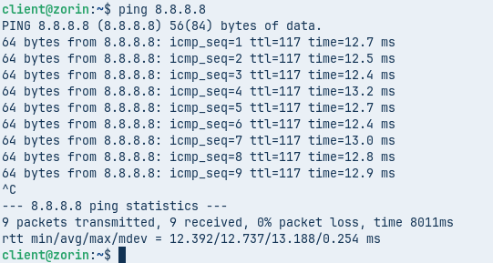

### 1.2 Instal·lació dels serveis SSH i Apache al Zorin
Executar la comanda:
```bash
sudo apt install apache2 openssh-server -y
```
**Captura del procés d’instal·lació:**
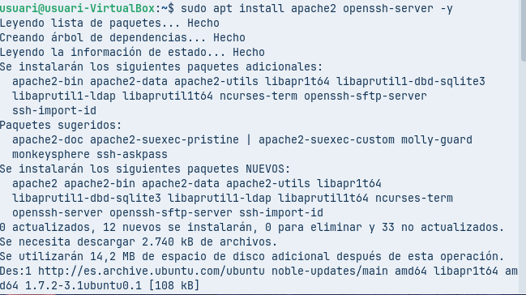

### 1.3 Personalització de la pàgina web
Crear un `index.html` amb un missatge distintiu (el nom de l’alumne):
```bash
echo "<h1>Aran20 - Zorin<h1>" | sudo tee /var/www/html/index.html
```

Comprovar localment que el servidor web funciona:
```bash
curl http://localhost
```
**Captura de la comprovació:**
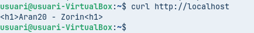

### 1.4 Comprovació del servei SSH local (opcional)
Assegurar-se que el servei SSH està actiu:
```bash
sudo systemctl status ssh
```
(No es requereix captura específica, però és convenient verificar-ho.)

## 2. Configuració de Destination NAT (DNAT) a IPFire

L’objectiu és exposar els serveis SSH (port 22) i HTTP (port 80) del Zorin (IP interna `192.169.2.1`) cap a l’exterior a través de la interfície RED de l’IPFire.

### 2.1 Accedir a les regles del tallafocs
Anar a **Firewall** > **Firewall Rules** > **New rule**.

### 2.2 Crear la regla per a SSH
- **Origen**: `RED` (o qualsevol)
- **Destinació**: `Cortafuegos (RED)` i port **22**
- **NAT**: marcar *Usar traducción de direcciones de red (NAT)* i triar *NAT de destino (DNAT)*.
- **Adreça IP interna**: `192.169.2.1`, port **22**.
- **Protocol**: TCP.

**Exemple de configuració:**
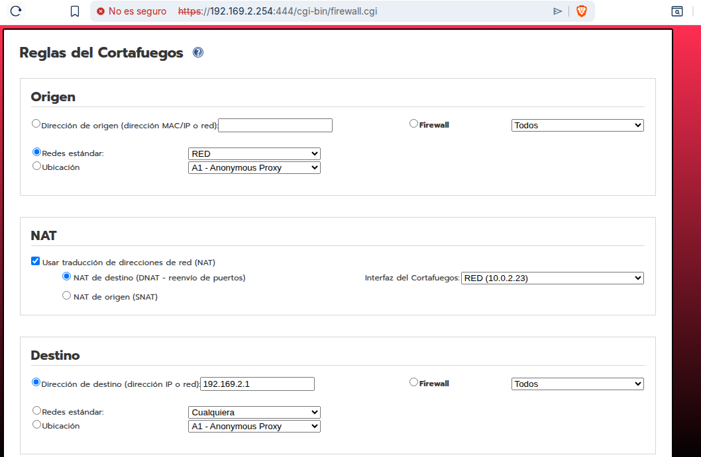
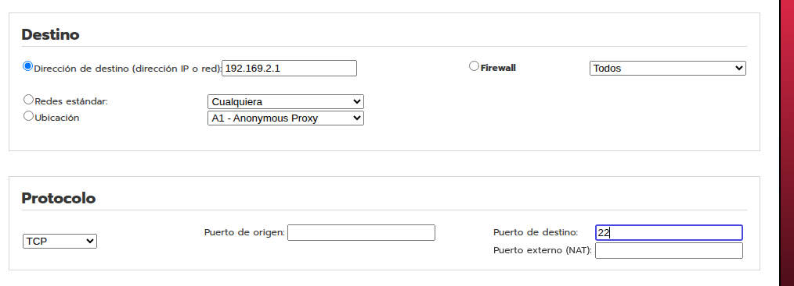

### 2.3 Crear la regla per a HTTP
Mateix procediment, però amb port extern **80** redirigit a port **80** del Zorin.

### 2.4 Aplicar els canvis
Després de crear les regles, fer clic a **Apply changes**.

**Llistat de regles actives:**
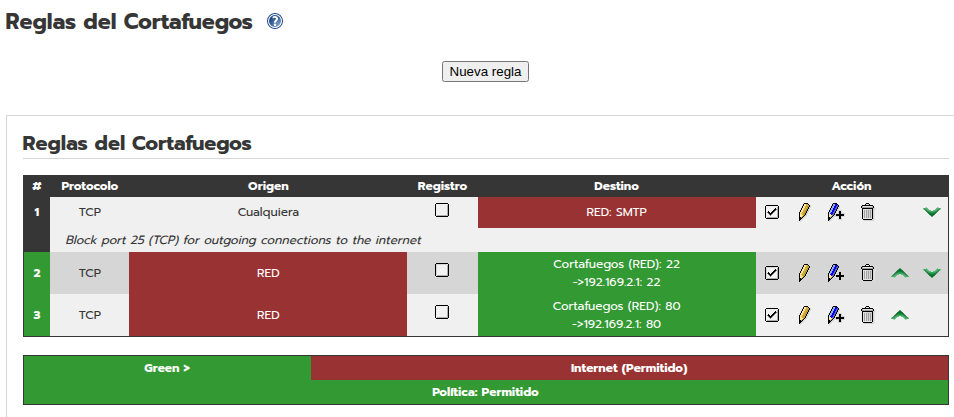

### 2.5 Comprovació des del Client (exterior)
El Client es troba a la mateixa xarxa NAT que la interfície RED de l’IPFire (per exemple `10.0.2.0/24`). L’adreça “pública” de l’IPFire és `10.0.2.23` (segons les captures).

- **Accés al servei web:** Obrir un navegador i anar a `http://10.0.2.23`. Ha de mostrar el missatge personalitzat.
  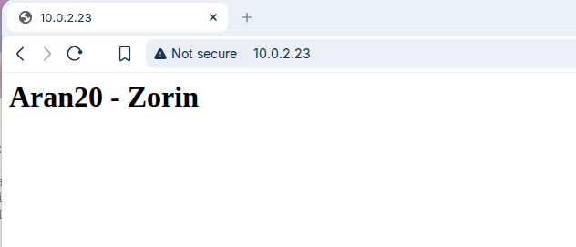

- **Accés per SSH:** Des del Client executar:
  ```bash
  ssh usuari@10.0.2.23
  ```
  (substituir `usuari` per un usuari vàlid del Zorin). S’ha de poder iniciar sessió.
  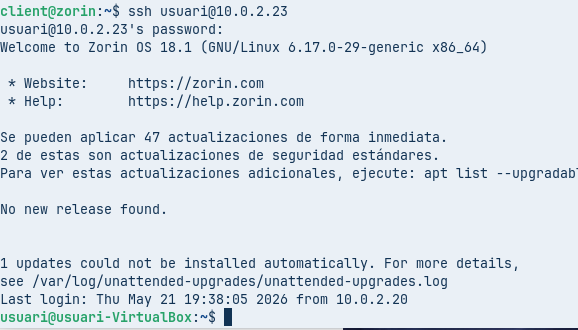

  Un cop dins, es pot llistar el directori personal per confirmar:
  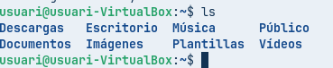

## 3. Configuració de VPN (OpenVPN)

Ara es configura l’accés remot mitjançant VPN perquè el Client pugui accedir a la xarxa interna (`192.169.2.0/24`) com si fos un equip de la LAN.

### 3.1 Generació de certificats a IPFire
Anar a **Servicios** > **OpenVPN** > **Autoridades de Certificado**.
Omplir els camps amb les dades de l’organització (per exemple, `aran20.test`, `aran20.foodlogistic.test`, etc.) i fer clic a **Generar certificados root/host**.

**Pantalla de generació:**
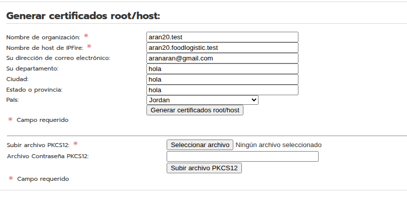

**Un cop generats, es mostren els certificats:**
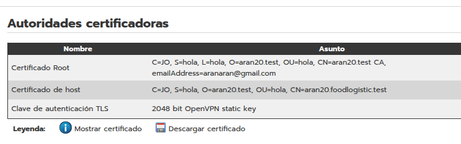

### 3.2 Crear una connexió VPN
Anar a **OpenVPN** > **Control y Status de conexión** > **Agregar**.
Triar *Conexión de un equipo a la red* (Host-to-net).

**Configuració general:**
- **Nombre**: `Serveis20`
- **Red**: seleccionar un grup d’adreces dinàmiques (per exemple `10.53.73.0/24`).
  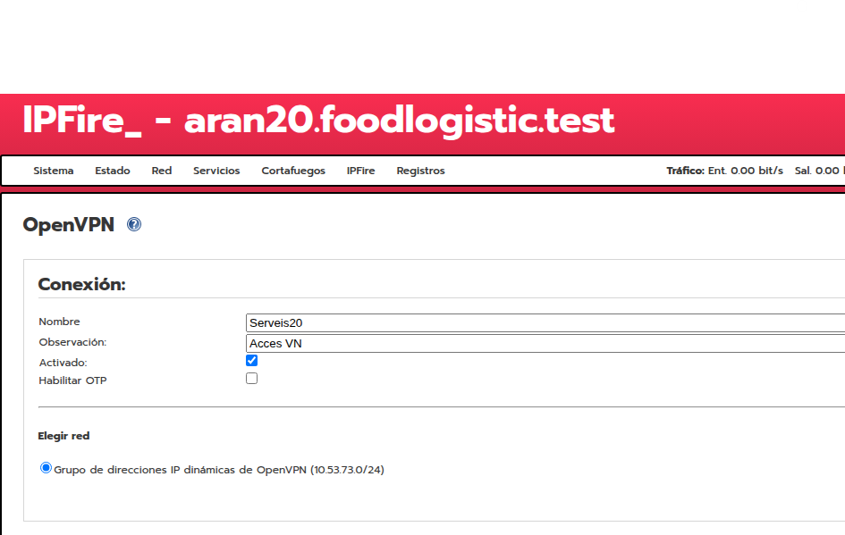

**Opcions avançades (pestanya *Cliente*):**
- Marcar *Redirect Gateway* (opcional, per a redirigir tot el trànsit).
- A **Enrutamiento** > *El cliente tiene acceso a estas redes...* seleccionar `Green` per permetre l’accés a la LAN.
  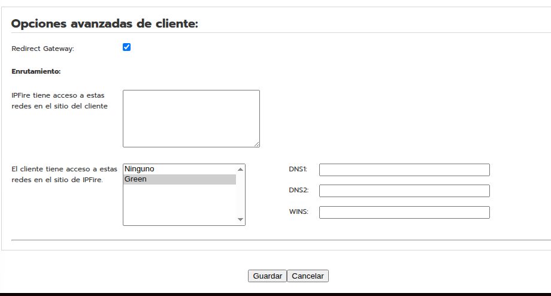

**Autenticació (pestanya *Autenticación*):**
Omplir les dades de l’usuari (per exemple, nom `ARAN`, organització `aran20.test`, etc.).
  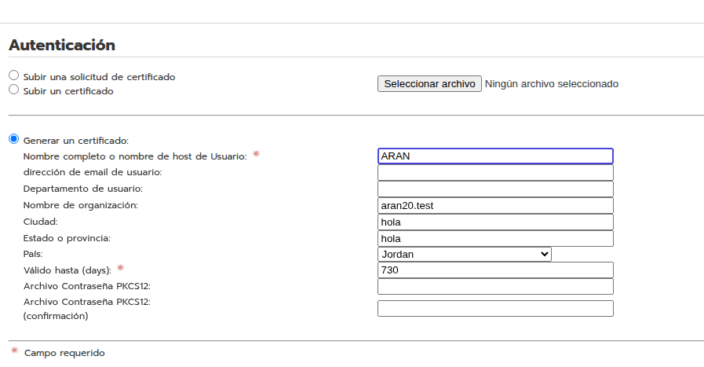

Guardar la connexió. L’estat inicial serà **DESCONECTADO**.
  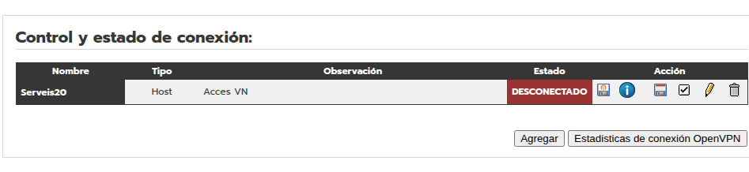

### 3.3 Descarregar els fitxers de configuració del client
A la llista de connexions, a l’acció de `Serveis20`, descarregar el perfil `.ovpn` i el certificat `.p12`.
  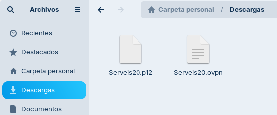

## 4. Configuració del client VPN

El Client (màquina exterior) pot ser Windows o Linux. En aquesta guia s’utilitza un client Linux (Zorin o Ubuntu).

### 4.1 Editar el fitxer `hosts`
Afegir una entrada perquè el client resolgui el nom del servidor VPN (el mateix que es va posar a IPFire: `aran20.foodlogistic.test`).
```bash
sudo nano /etc/hosts
```
Afegir la línia:
```
192.169.2.254   aran20.foodlogistic.test
```
**Captura:**
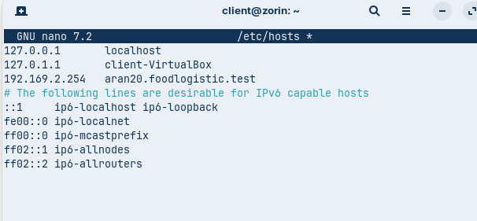

### 4.2 Instal·lar OpenVPN
```bash
sudo apt install openvpn -y
```
**Captura:**
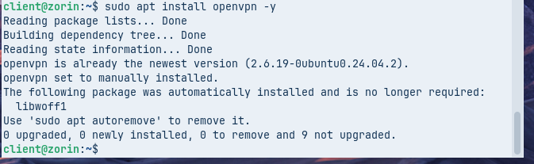

### 4.3 Importar la configuració al gestor de xarxa
Copiar els fitxers `Serveis20.ovpn` i `Serveis20.p12` al client (per exemple, a la carpeta `Descargas`).

**Fitxers descarregats:**
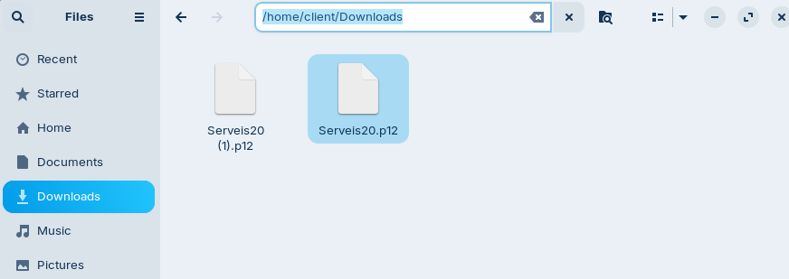

Anar a **Configuració de xarxa** > **VPN** > **+ Afegir** > **Importar des d’un fitxer...** i seleccionar `Serveis20.ovpn`.

A la pestanya **Autenticació**:
- **Tipus**: *Password with Certificates (TLS)*
- **Nom d’usuari**: el que es va definir a IPFire (p. ex. `ARAN`)
- **Certificat CA**, **Certificat d’usuari** i **Clau privada**: seleccionar el fitxer `Serveis20-pkcs12.pem` (generat automàticament en importar).
- **Contrasenya de la clau**: la que es va definir en generar el certificat.

**Exemple de configuració:**
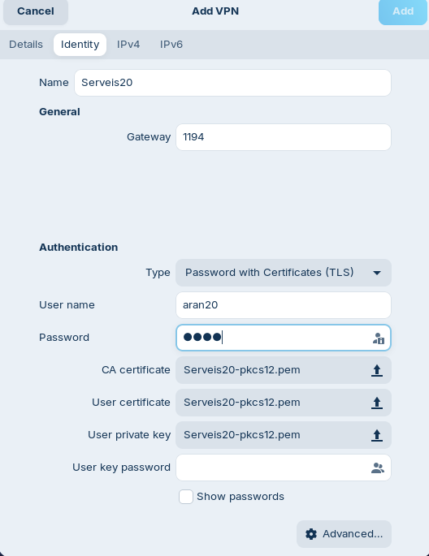

### 4.4 Connectar la VPN
Activar la connexió VPN des del menú de xarxa. L’estat ha de canviar a **Connectat**.
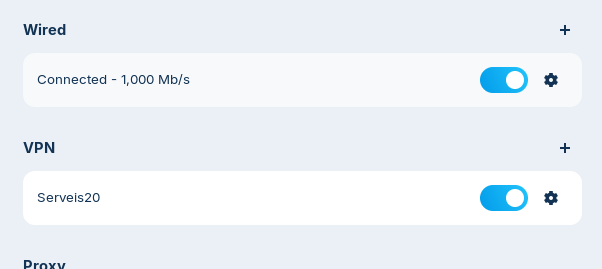

## 5. Comprovacions finals amb la VPN activa

Un cop connectat el Client a la VPN, aquest té accés a la xarxa interna (`192.169.2.0/24`). Cal verificar:

- **Accés a la pàgina web del Zorin** utilitzant la seva IP privada (`192.169.2.1`):
  ```bash
  curl http://192.169.2.1
  ```
  o obrir un navegador amb `http://192.169.2.1`. Ha de mostrar el mateix missatge personalitzat.

- **Accés per SSH** a la IP privada del Zorin:
  ```bash
  ssh usuari@192.169.2.1
  ```

*(No es requereixen captures addicionals per a aquestes comprovacions, però és convenient incloure’n alguna al lliurament.)*

## 6. Resum de les captures obligatòries per a la correcció

| Núm. | Fitxer      | Descripció |
|------|-------------|-------------|
| 1    | `img/20.png` | Ping a 8.8.8.8 des del Zorin |
| 2    | `img/1.png`  | Instal·lació d’apache2 i openssh-server |
| 3    | `img/2.png`  | Prova local del servei web (`curl localhost`) |
| 4    | `img/4.png`  | Regla DNAT per a SSH (part superior) |
| 5    | `img/5.png`  | Regla DNAT per a SSH (part inferior) |
| 6    | `img/6.png`  | Llistat de regles del tallafocs aplicades |
| 7    | `img/7.png`  | Accés a la pàgina web des del Client (IP pública) |
| 8    | `img/30.png` | Connexió SSH des del Client (IP pública) |
| 9    | `img/40.png` | Llistat de directori després de l’SSH |
| 10   | `img/8.png`  | Generació de certificats root/host |
| 11   | `img/9.png`  | Autoritats certificadores generades |
| 12   | `img/10.png` | Configuració general de la connexió VPN |
| 13   | `img/12.png` | Opcions avançades de routing |
| 14   | `img/11.png` | Dades d’autenticació de l’usuari VPN |
| 15   | `img/13.png` | Connexió VPN creada (estat DESCONECTADO) |
| 16   | `img/14.png` | Fitxers `.ovpn` i `.p12` descarregats |
| 17   | `img/15.png` | Fitxer `hosts` editat al client |
| 18   | `img/16.png` | Instal·lació d’OpenVPN al client |
| 19   | `img/17.png` | Fitxers de configuració a la carpeta Descargas |
| 20   | `img/18.png` | Importació de la VPN al gestor de xarxa |
| 21   | `img/19.png` | Connexió VPN activada |

---
