# Guia de configuració del proxy IPFire per al filtrat de contingut

A continuació s’explica el procés seguit per complir amb totes les activitats sol·licitades pel professor. Les captures de pantalla mostren cada pas i els resultats obtinguts.

## 1. Preparació inicial de les interfícies de xarxa

Abans de configurar el proxy, ens assegurem que IPFire tingui les interfícies ben definides: **GREEN** (xarxa interna) i **RED** (connexió a Internet).  

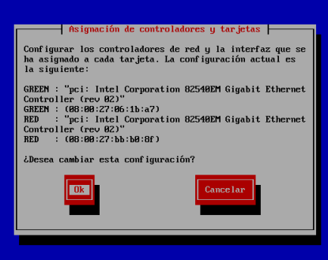  
Assignem la IP estàtica a la interfície GREEN: `192.169.20.254/24`.  

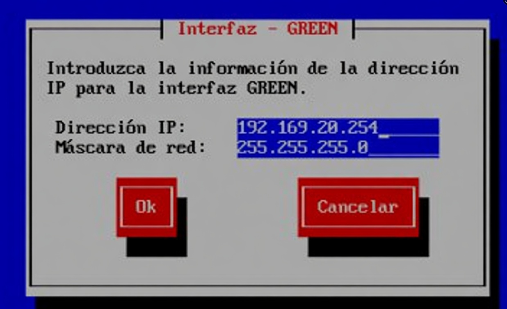  
La interfície RED es configura amb DHCP per rebre IP del router d’accés.  

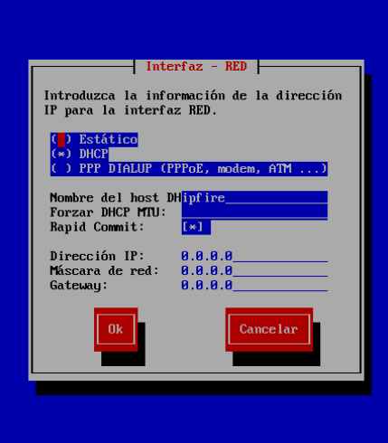  

Comprovem amb `ip a` que les dues interfícies estan actives:  
- `red0`: `10.0.2.22` (IP dinàmica)  
- `green0`: `192.169.20.254` (estàtica)  

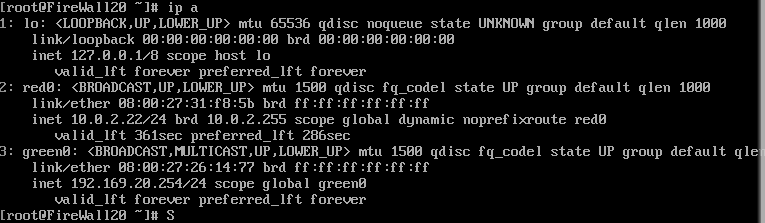  

Des d’un client a la xarxa GREEN (IP `192.169.20.1`) es pot fer ping a `8.8.8.8`, confirmant que el routing funciona.  

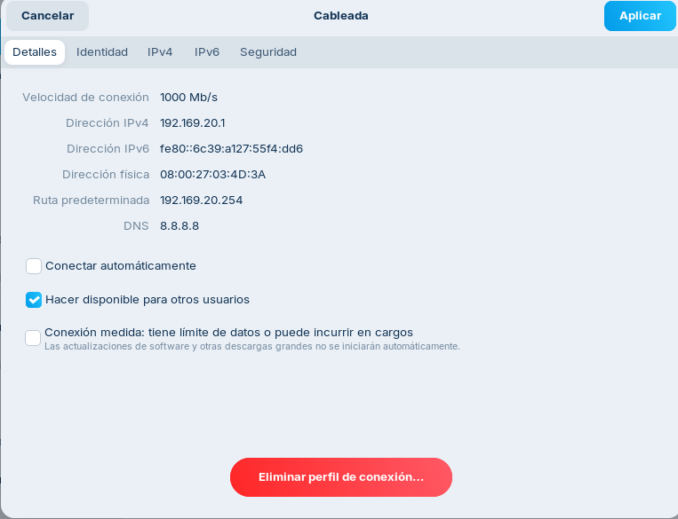  
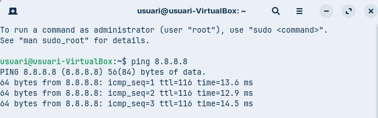  

El panell principal d’IPFire mostra el resum de les connexions.  

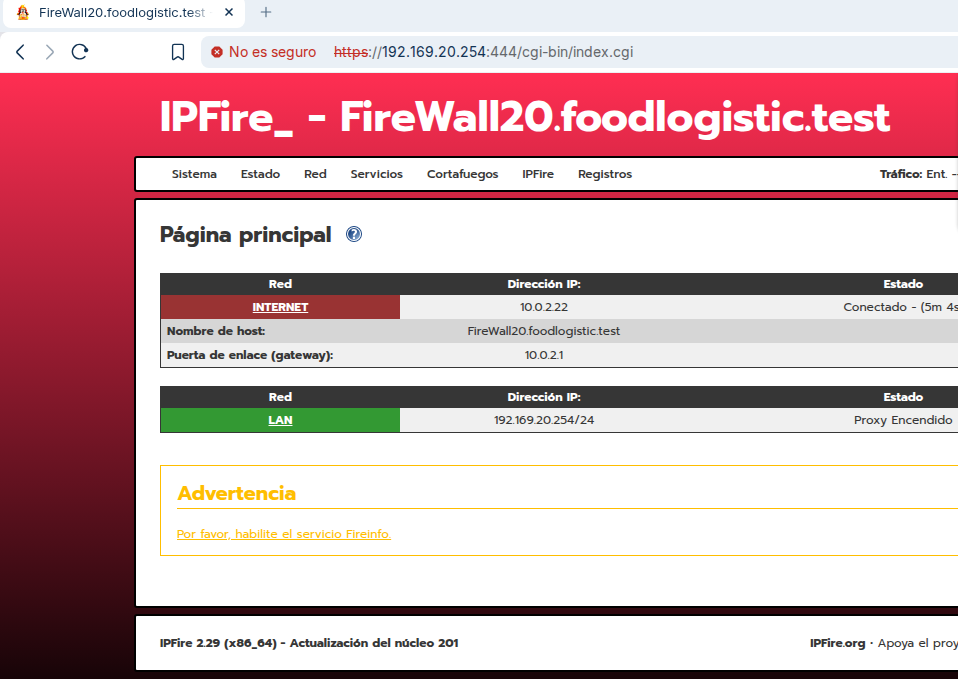  

## 2. Activació del proxy web i configuració bàsica

Accedim a *Web Proxy* > *Advanced Web Proxy*. Activem el proxy en mode transparent a GREEN (així els clients no han de configurar res manualment).  
- Port del proxy: `800`  
- Port transparent: `3128`  

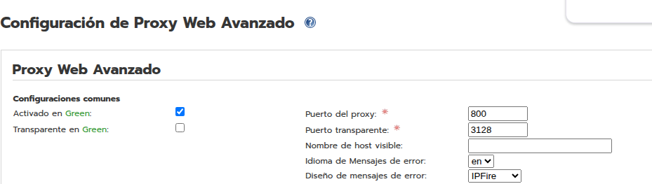  

Un cop activat, tot el trànsit HTTP/HTTPS serà interceptat pel proxy i podrem aplicar filtres.

## 3. Instal·lació de les llistes negres (URL Filter)

A *URL Filter* > *Maintenance* es poden instal·lar les llistes negres predefinides. IPFire descarrega bases de dades de categories (proporcionades per projectes com Shallalist o UT1).  

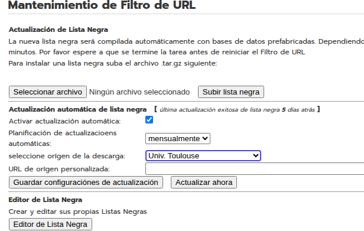  
Les actualitzem automàticament per tenir les categories actualitzades.

## 4. Configuració de la pàgina de bloqueig que mostri la URL bloquejada

Dins de *Web Proxy* > *Advanced Web Proxy* > *Error Message Language/Design* es pot triar una plantilla. Per defecte IPFire ja mostra la URL sol·licitada en el missatge de denegació. Verificarem que ho fa en les proves següents.

## 5. Bloqueig per categories: *bank* i *radio*

A *URL Filter* > *Configuration* marquem les categories **financial** (bank) i **radio**.  

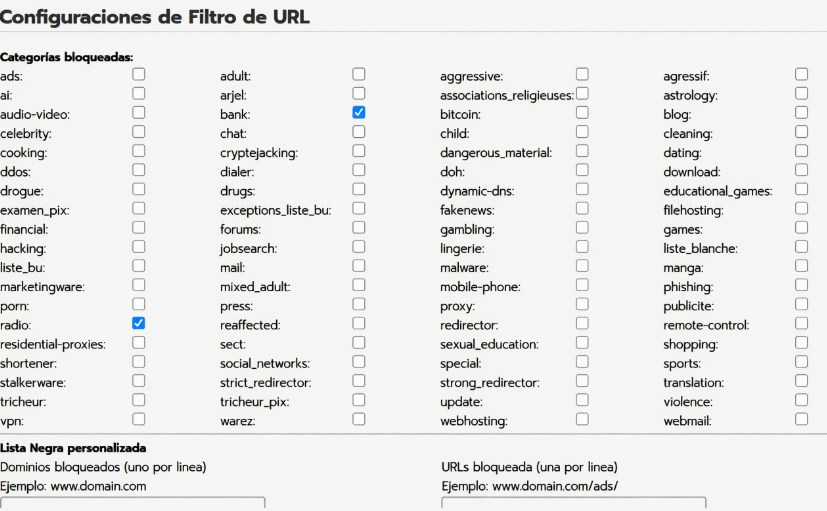  

**Prova amb `ing.es` (categoria banc):** el navegador mostra un error `ERR_TUNNEL_CONNECTION_FAILED`, indicant que el proxy ha bloquejat la connexió.  

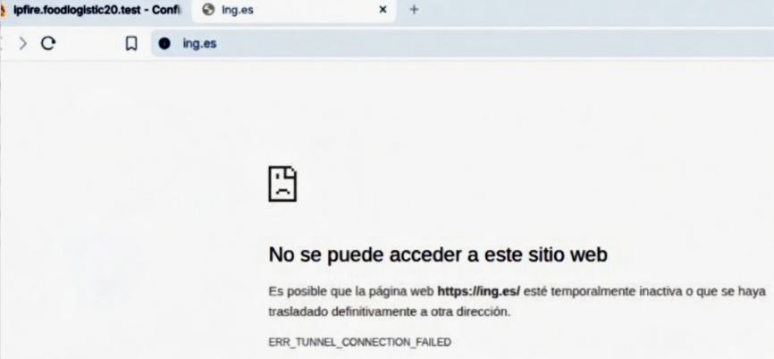  

**Prova amb `ah.fm` (ràdio online):** apareix la pàgina de denegació d’IPFire indicant “ACCESS DENIED”.  

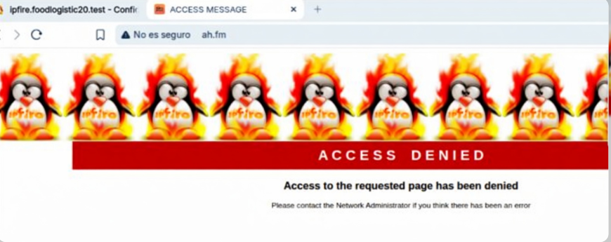  

Així confirmem que el filtrat per categories funciona.

## 6. Bloqueig manual de dominis complets

A la mateixa configuració del URL Filter, a **Lista Negra personalizada** > *Dominios bloqueados* afegim:  
```
elnacional.cat
tecnocampus.cat
```  

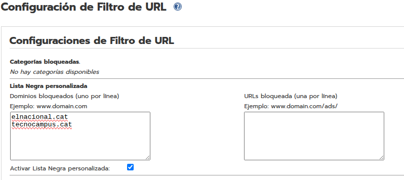  

Quan intentem accedir a `www.elnacional.cat` o `tecnocampus.cat`, el proxy bloqueja i mostra “ACCESS DENIED”.  

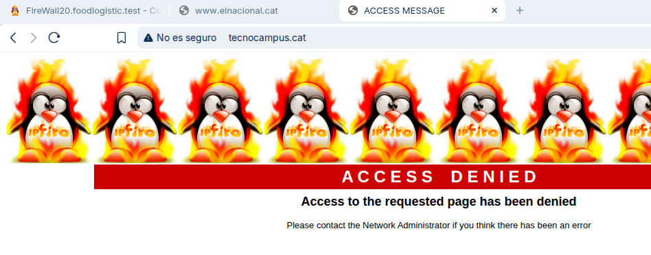  
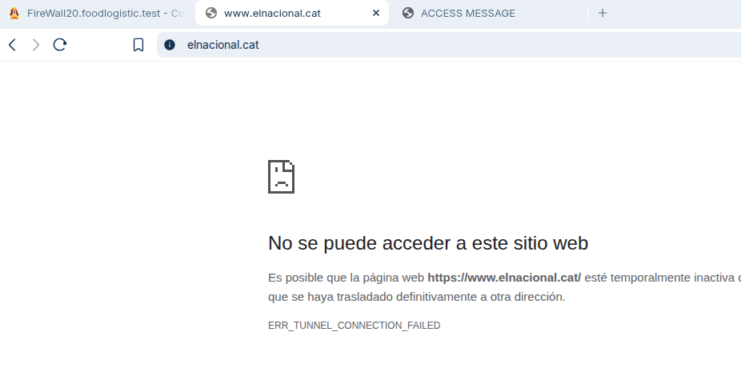  

## 7. Bloqueig d’una URL concreta d’un domini, però no la resta

Per bloquejar només una pàgina específica, utilitzem la secció **URLs bloquejades (una per línia)**.  
Per exemple, per bloquejar `www.youtube.com` però sense bloquejar la resta de Google, afegim `https://www.youtube.com/`.  

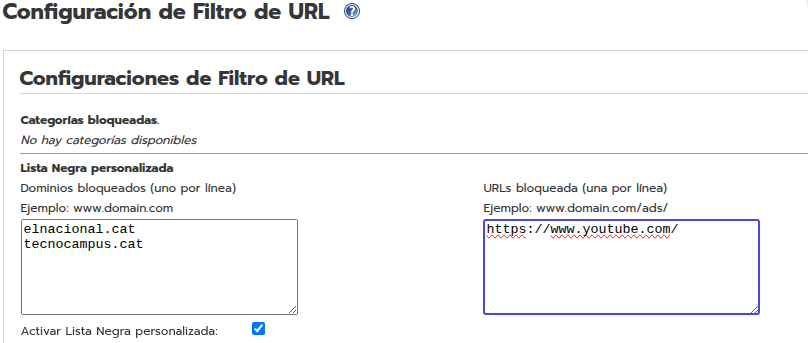  

En intentar accedir a YouTube, el proxy retorna un error DNS (perquè bloqueja la resolució d’aquest FQDN concret).  

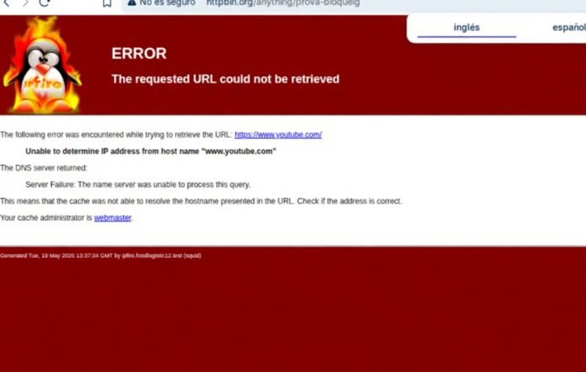  

En canvi, altres dominis com `google.com` segueixen funcionant normalment.

## 8. Bloqueig per paraula clau “anime” amb excepció d’`animenewsnetwork.com`

A *URL Filter* > *Configuration*, activem la **Lista de frases personalizadas** i hi afegim la paraula `anime`.  

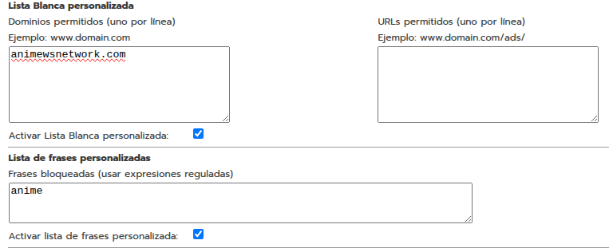  

A més, a la **Lista Blanca personalizada** (Dominis permesos) afegim `animenewsnetwork.com` perquè quedi exclòs del filtre.  

  

**Resultats:**  
- Qualsevol pàgina que contingui “anime” al nom de domini o a la URL serà bloquejada (ex: `animebusca.com`, `animefiguras.com`).  
  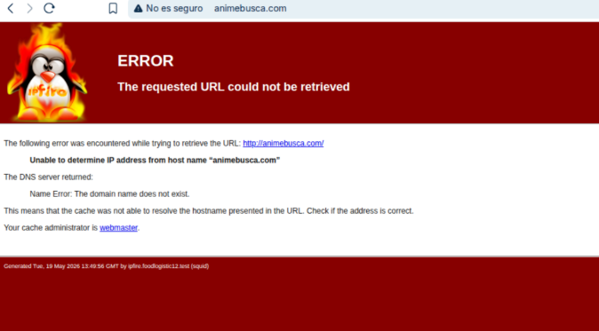 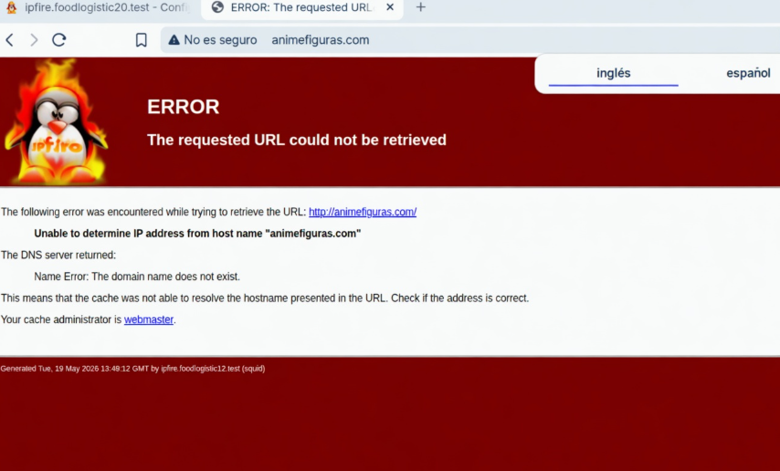  
- En canvi, `animenewsnetwork.com` es carrega sense problemes.  
  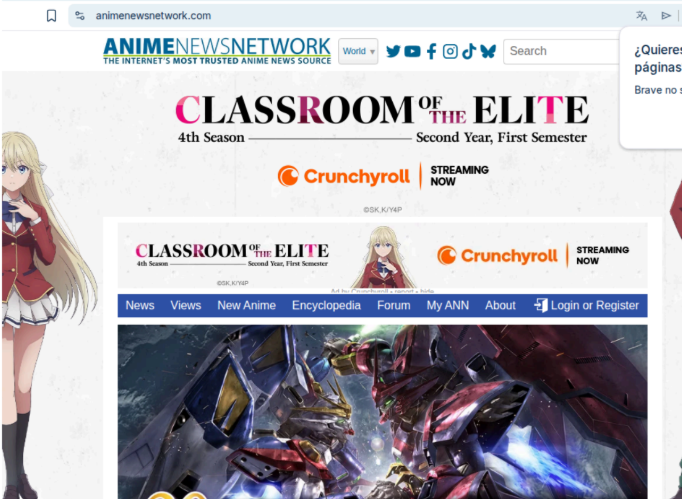  

## 9. Prova de bloqueig per hores

Per aplicar restriccions temporals, anem a *Firewall* > *Rules* i creem una regla que permeti navegació només en franges horàries concretes.  

Exemple: permetre TCP als ports 80 i 443 des de GREEN cap a RED, els dies **dimarts, dimecres, dijous, divendres** de **16:00 a 17:00**.  

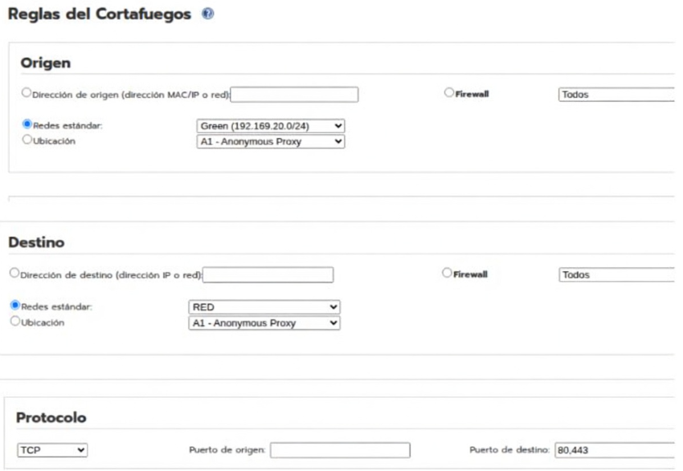  
A *Ajustes adicionales* marquem *Usar restricciones de tiempo* i seleccionem els dies i l’interval.  

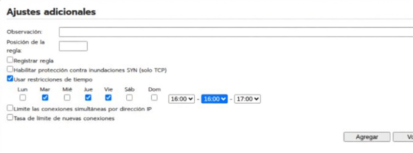  

Fora d’aquest horari, les connexions web queden bloquejades pel tallafocs (no pel proxy). Això permet controlar l’accés a Internet basat en el calendari.

## Resum de comprovacions

| Activitat | Mètode | Resultat |
|-----------|--------|----------|
| Mostrar URL bloquejada | Plantilla per defecte d’IPFire | Es mostra la URL denegada |
| Instal·lar llistes negres | URL Filter > Maintenance | Descarregades correctament |
| Bloquejar bank i radio | Marcar categories *financial*, *radio* | ing.es i ah.fm bloquejats |
| Bloquejar dominis complets | Llista negra personalitzada | elnacional.cat i tecnocampus.cat denegats |
| Bloquejar URL concreta | URLs bloquejades | www.youtube.com bloquejat, google.com funciona |
| Bloquejar “anime” excepte un domini | Frases bloquejades + llista blanca | anime*.com bloquejat, animenewsnetwork.com permès |
| Bloqueig per hores | Regla de firewall amb restricció temporal | Navegació només dimarts a divendres 16-17h |

Totes les activitats s’han verificat amb èxit. La configuració queda enllestida segons els requisits.